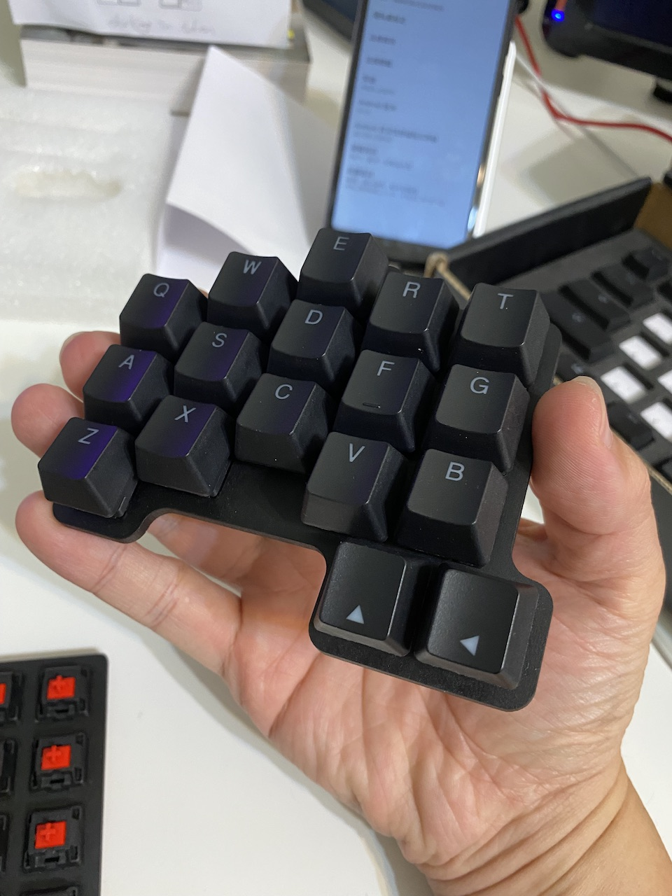

# Phalanx

Phalanx /ˈfælæŋks/ 「手趾骨」是我為了要找到一個可以快速實驗各種鍵盤配置的方法而設計的四按鍵的PCB。

這設計參考了[Saoto Tsuchiya](https://github.com/saoto28/pineapple60/blob/main/p4/README.md)的測試模組，加以簡化而成。

搭配熱插拔後，就可以快速的實驗各種鍵盤配置。

在幾天的時間內，我就找到我理想的鍵盤配置了,我稱它為「[務實](https://github.com/jamessa/Pragmatic)34」。

PCB 

